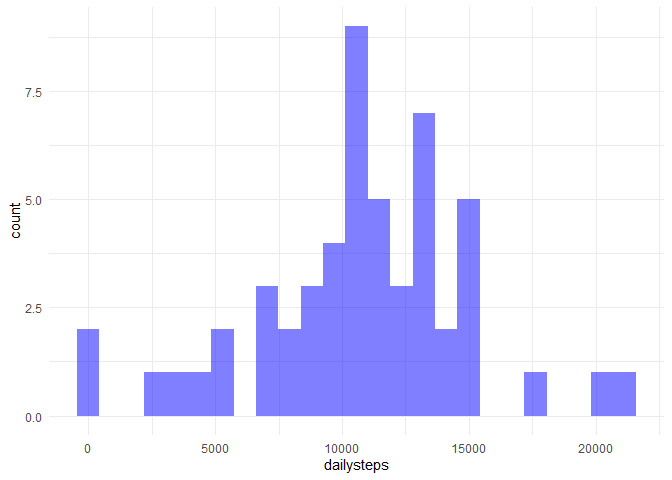
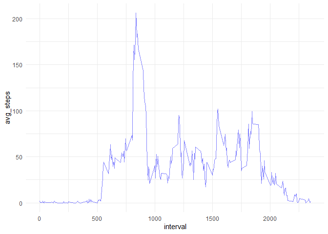
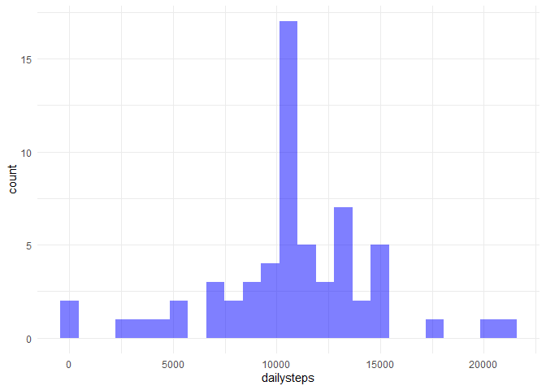
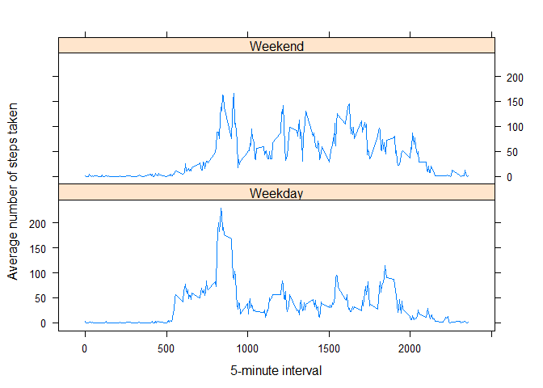

## Load Packages


```r
library(tidyverse)
```


## Loading and preprocessing the data


```r
activity_df <- read.csv(unzip("activity.zip"))
```

## What is mean total number of steps taken per day?


```r
dailysteps <- activity_df %>%
    group_by(date) %>%
    summarise(dailysteps = sum(steps)) %>%
    drop_na()

dailysteps %>%
    ggplot(mapping = aes(dailysteps)) +
    geom_histogram(bins = 25, fill = "blue", alpha = .5) +
    theme_minimal()
```

<!-- -->

```r
#Mean
mean(dailysteps$dailysteps)
```

```
## [1] 10766.19
```

```r
#Median
median(dailysteps$dailysteps)
```

```
## [1] 10765
```

## What is the average daily activity pattern?


```r
dailyactivity <- activity_df %>%
    group_by(interval) %>%
    summarise(avg_steps = mean(steps, na.rm = TRUE)) 

dailyactivity %>%
    ggplot(mapping = aes(interval, avg_steps)) +
    geom_path(color = "blue", alpha = .5) +
    theme_minimal()
```

<!-- -->

The interval with the highest average of steps is 835. This interval is at 8:35 AM


```r
#Interval with the highest average of steps

dailyactivity[which.max(dailyactivity$avg_steps),]
```

```
## # A tibble: 1 x 2
##   interval avg_steps
##      <int>     <dbl>
## 1      835      206.
```

## Imputing missing values

The missing values are in the steps variable. There are 2304 NA's.


```r
summary(activity_df)
```

```
##      steps            date              interval     
##  Min.   :  0.00   Length:17568       Min.   :   0.0  
##  1st Qu.:  0.00   Class :character   1st Qu.: 588.8  
##  Median :  0.00   Mode  :character   Median :1177.5  
##  Mean   : 37.38                      Mean   :1177.5  
##  3rd Qu.: 12.00                      3rd Qu.:1766.2  
##  Max.   :806.00                      Max.   :2355.0  
##  NA's   :2304
```


Devise a strategy for filling in all of the missing values in the dataset. The strategy does not need to be sophisticated. For example, you could use the mean/median for that day, or the mean for that 5-minute interval, etc.

In order to fill for the missing values, the steps mean of the 5-minute interval will be used for the corresponding observations with missing values.

In the next code chunk, is the code to create a new dataframe without missing values. 


```r
activity_df_filled <- activity_df 

activity_df_filled$steps <- ifelse(is.na(activity_df_filled$steps) == TRUE,
dailyactivity$avg_steps[dailyactivity$interval %in% activity_df_filled$interval],
activity_df_filled$steps)

#Round mean steps
activity_df_filled$steps <- round(activity_df_filled$steps)
```


Make a histogram of the total number of steps taken each day and Calculate and report the mean and median total number of steps taken per day. Do these values differ from the estimates from the first part of the assignment? What is the impact of imputing missing data on the estimates of the total daily number of steps?


```r
dailysteps_filled <- activity_df_filled %>%
    group_by(date) %>%
    summarise(dailysteps = sum(steps)) 

dailysteps_filled %>%
    ggplot(mapping = aes(dailysteps)) +
    geom_histogram(bins = 25, fill = "blue", alpha = .5) +
    theme_minimal()
```

<!-- -->

```r
#Mean
mean(dailysteps_filled$dailysteps)
```

```
## [1] 10765.64
```

```r
#Median
median(dailysteps_filled$dailysteps)
```

```
## [1] 10762
```


## Are there differences in activity patterns between weekdays and weekends?


```r
#I'm going to used the data frame with filled data for a better aproxximation

#First I will format the date variable, since it is a character.
library(lubridate)

activity_df_filled$date <- ymd(activity_df_filled$date)

str(activity_df_filled)
```

```
## 'data.frame':	17568 obs. of  3 variables:
##  $ steps   : num  2 0 0 0 0 2 1 1 0 1 ...
##  $ date    : Date, format: "2012-10-01" "2012-10-01" ...
##  $ interval: int  0 5 10 15 20 25 30 35 40 45 ...
```

```r
#Add variable to identify weekday or weekend

activity_df_filled <- activity_df_filled %>%
  mutate(dayname = weekdays(activity_df_filled$date)) %>%
  mutate(weekname = ifelse(dayname == "Saturday" | dayname == "Sunday", yes = "Weekend", no = "Weekday")) 
    
#calculate mean

avg_steps_interval <- aggregate(steps ~ interval + weekname, FUN=mean, 
                                    data=activity_df_filled)

#plot
library(lattice)
xyplot(steps ~ interval | weekname, 
       data = avg_steps_interval, 
       type = "l", 
       layout = c(1, 2), 
       xlab = "5-minute interval", 
       ylab = "Average number of steps taken")
```

<!-- -->

